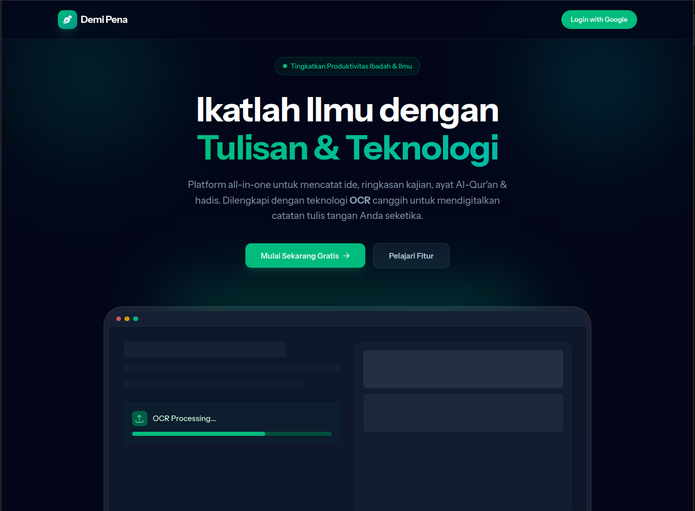
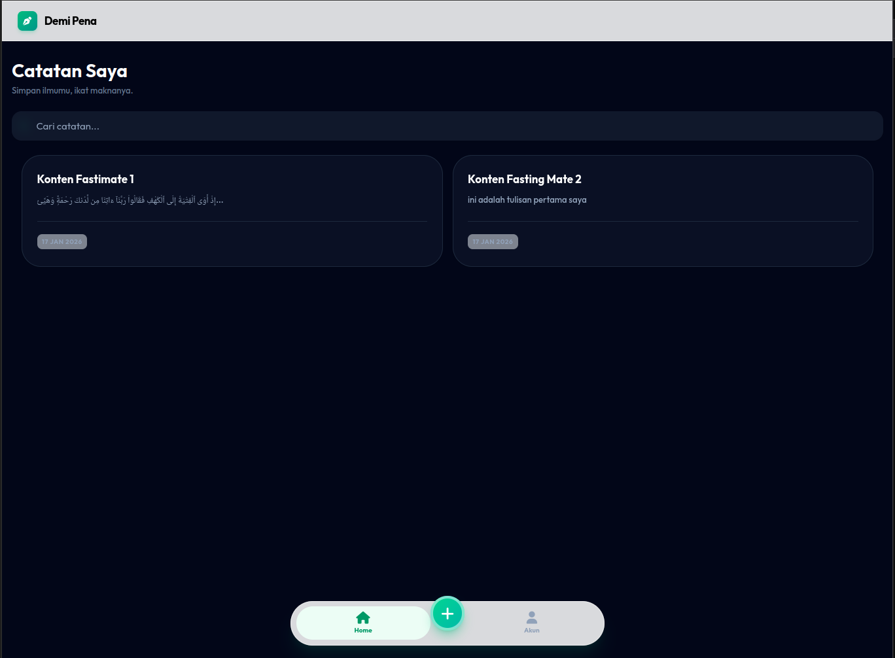
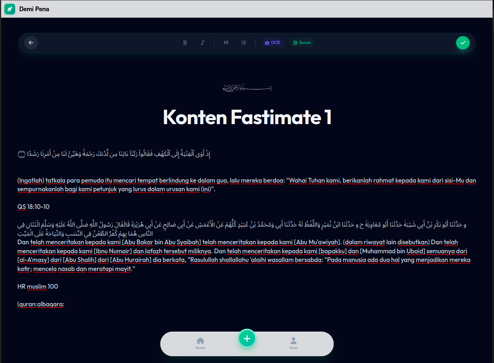
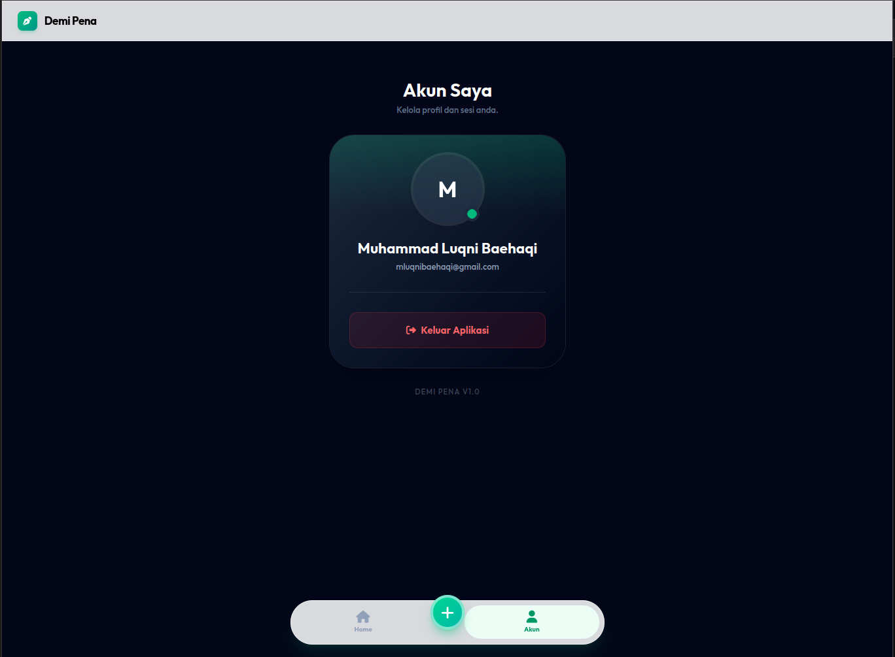

# Demi Pena 🖋️

**Demi Pena** adalah aplikasi pencatat modern (Note-Taking App) yang dirancang khusus dengan fitur-fitur Islami untuk memudahkan pencatatan ilmu, tadabbur Al-Qur'an, dan hadits.

Aplikasi ini mengusung desain **"Glassmorphism"** yang bersih, modern, dan mobile-first, memberikan pengalaman menulis yang tenang dan fokus.



## ✨ Fitur Utama

-   **Editor Full-Width & Seamless**: Pengalaman menulis tanpa gangguan dengan tampilan seperti kertas penuh.
-   **Smart Quran Import**:
    -   Ketik `(quran:kahfi:1-10)` untuk otomatis menyisipkan ayat Al-Qur'an beserta terjemahannya.
    -   **Auto-Correction / Spell Checker**: Salah ketik nama surat? (contoh: `alkahfii`) Sistem akan memberikan saran perbaikan via popup pintar.
    -   **Verse Suggestion**: Modal pencarian surat dan ayat yang mudah digunakan.
-   **Hadith Import**: Ketik `(muslim:1)` untuk menyisipkan hadits.
-   **OCR (Image to Text)**: Scan tulisan dari buku atau gambar langsung ke editor.
-   **Modern UI/UX**:
    -   Sticky Header & Floating Bottom Navigation.
    -   Dark Mode Support 🌙.
    -   Auto-dismissing alerts.
    -   Live Search Catatan.

## 🛠️ Teknologi yang Digunakan

Aplikasi ini dibangun menggunakan stack modern yang handal:

-   **Backend**: [Laravel](https://laravel.com/) (PHP)
-   **Frontend**: [Blade Templates](https://laravel.com/docs/blade)
-   **Styling**: [Tailwind CSS](https://tailwindcss.com/) (Mobile-First, Custom Fonts)
-   **Editor**: [Quill.js](https://quilljs.com/) (Wysiwyg Rich Text Editor)
-   **Bundler**: [Vite](https://vitejs.dev/)
-   **Icons**: [Font Awesome 6](https://fontawesome.com/)
-   **Database**: SQLite (Default) / MySQL compatible.

### Integrasi API Eksternal
-   **Al-Quran**: `api.alquran.cloud`
-   **Hadith**: `api.hadith.gading.dev`
-   **OCR Engine**: `ocr.space`

---

## 🚀 Cara Install & Menjalankan

Ikuti langkah berikut untuk menjalankan project di komputer lokal anda:

### Prasyarat
-   PHP >= 8.1
-   Composer
-   Node.js & NPM

### Langkah-langkah

1.  **Clone Repository**
    ```bash
    git clone https://github.com/username/demi-pena.git
    cd demi-pena
    ```

2.  **Install Dependencies Backend**
    ```bash
    composer install
    ```

3.  **Install Dependencies Frontend**
    ```bash
    npm install
    ```

4.  **Konfigurasi Environment**
    Salin file `.env.example` menjadi `.env`:
    ```bash
    cp .env.example .env
    ```
    Generate application key:
    ```bash
    php artisan key:generate
    ```

5.  **Setup Database**
    Secara default menggunakan SQLite. Pastikan file database ada:
    ```bash
    touch database/database.sqlite
    ```
    Jalankan migrasi:
    ```bash
    php artisan migrate
    ```

6.  **Build Assets**
    ```bash
    npm run build
    ```
    *(Atau gunakan `npm run dev` untuk development mode)*

7.  **Jalankan Server**
    ```bash
    php artisan serve
    ```

Akses aplikasi di: `http://localhost:8000`

---

## 📸 Screenshots

| Welcome Page | Dashboard |
|:---:|:---:|
|  |  |

| Editor (Clean) | Smart Suggestion |
|:---:|:---:|
|  |  |

| Profile (Dark Mode) | Quran Modal |
|:---:|:---:|
|  |  |

---

## 📝 Lisensi

[MIT License](LICENSE). Dibuat dengan ❤️ untuk Penuntut Ilmu.
